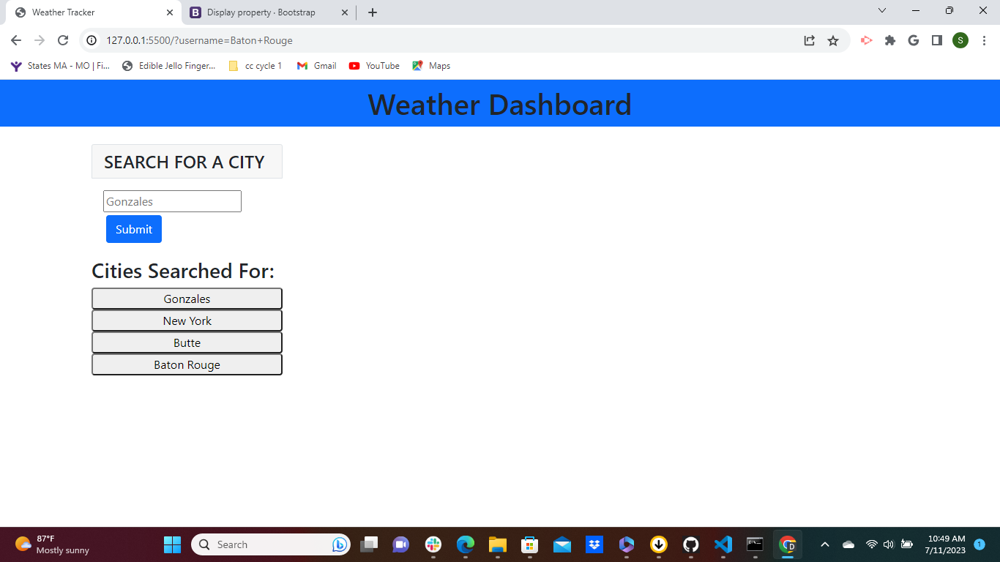
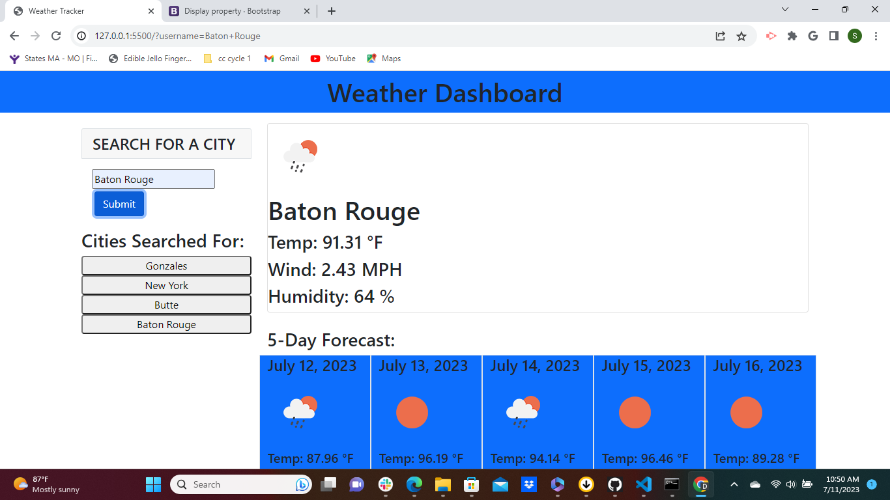
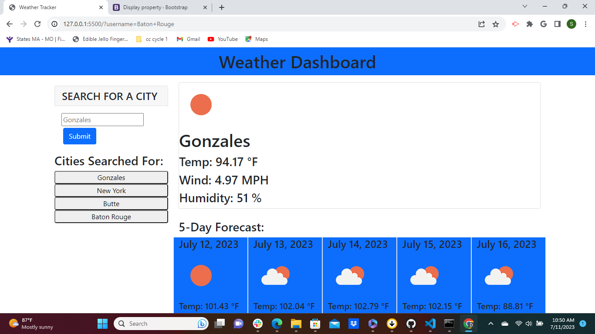

# Weather-Tracker-App

## Description
This project is a weather app that gives the user an input box to search by city. It saves the last 5 previous searches using local storage. This is our first project using 3rd-party api. It was difficult. I struggled the most with getting the info to save in an array to local storage.     
  
## Usage
https://sjones-njones.github.io/Weather-Tracker-App/

https://github.com/sjones-njones/Weather-Tracker-App.git

## Credits
While I didn't work directly with anyone on this project, my cohort group helped answer many of my questions. I really enjoy the collaborative nature of this program.  I also received help from a tutor. I also used the following sites for help and suggestions.

https://developer.mozilla.org

https://www.w3schools.com

## License
Please refer to the LICENSE in the repo.
 